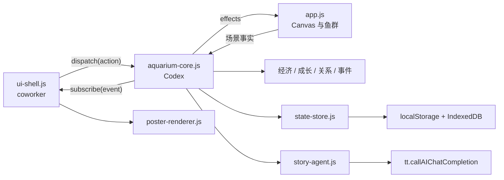

# 私人记忆生态缸：协作架构与接口契约

> 状态说明：本文保留为总体背景。2026-07-29 起，具体文件所有权、按钮名称和接口以 `docs/roles/2026-07-29-frontend-owner.md` 与 `docs/roles/2026-07-29-backend-owner.md` 为准；故事策划按后端任务书中的数据格式独立维护模板。

日期：2026-07-29

适用阶段：黑客松最后 10 小时

目标：Codex 负责玩法核心、存档、AI、事件、成长和远游；coworker 负责主界面及所有视觉交互。双方通过稳定的 Core API、动作和事件协作，避免同时编辑同一文件。

## 1. 分工结论

### Codex 负责

- 饲料、在线/离线收益和容量升级；
- 浏览器本地存档、备份和旧存档兼容；
- 鱼的两事件成长、投喂成长和远游结算；
- 鱼—物品、鱼—鱼、物品—物品关系；
- 10 类本地事件、冷却和重复控制；
- `doubao-seed-2-1-turbo-260628` AI 故事调用与模板回退；
- 记忆数据、远游数据和海报 Canvas 合成；
- 现有 `app.js` 鱼缸渲染接线；
- 核心测试、Fastify 静态路由和开发文档。

### Coworker 负责

- 主界面视觉；
- 顶部状态、底部操作栏的样式与布局；
- 记忆册、商店、远游确认、离线摘要和海报预览弹层；
- 响应式横屏、安全区、动效和视觉资源；
- `ui-shell.js` 中的 DOM 创建、展示和用户事件绑定；
- UI 手工验证。

### 明确不交叉

- Codex 不修改 coworker 的视觉布局和 CSS；
- coworker 不实现饲料、成长、关系、事件、AI、远游奖励或存档规则；
- UI 不直接修改 Core state；
- Core 不查询或创建 UI DOM。

## 2. 文件所有权

| 文件 | 所有者 | 说明 |
| --- | --- | --- |
| `game/index.html` | coworker | 保留现有关键 ID，并增加本契约规定的新挂载点 |
| `game/styles.css` | coworker | 所有主界面、弹层和响应式视觉 |
| `game/js/ui-shell.js` | coworker | UI 渲染、弹层状态和用户操作到 action 的映射 |
| `game/assets/ui/*` | coworker | 新增 UI 视觉资源；只能使用本地相对路径 |
| `game/js/app.js` | Codex | 现有 Canvas、鱼群行为和 Core 接线 |
| `game/js/aquarium-core.js` | Codex | 唯一对外玩法 facade |
| `game/js/state-store.js` | Codex | localStorage 主/备份和迁移 |
| `game/js/economy-system.js` | Codex | 饲料和容量 |
| `game/js/relationship-system.js` | Codex | 关系和绑定目标 |
| `game/js/growth-journey.js` | Codex | 成长和远游 |
| `game/js/event-director.js` | Codex | 本地事件导演 |
| `game/js/story-agent.js` | Codex | AI 故事和回退 |
| `game/js/poster-renderer.js` | Codex | 海报 Canvas 输出 |
| `game/js/cutout-flow.js` | Codex | 现实物品放入 payload |
| `src/routes/game.ts` | Codex | 开发服务器静态路由 |
| `test/game-*.test.*` | Codex | 核心和现有集成测试 |

如果某一方必须修改对方所有的文件，先发一条包含“文件、原因、所需 hook”的消息，不直接越界修改。

## 3. 分支建议

- Core 分支：`codex/memory-aquarium-core`
- UI 分支：`codex/memory-aquarium-ui`

合并顺序：

1. Core 先提供 `aquarium-core.js` 空壳和本契约中的动作/事件；
2. UI 基于固定接口开发；
3. Core 完成 `app.js` 接线；
4. UI 分支合并或 rebase Core；
5. 统一联调；
6. T+8 小时冻结接口，只修 P0/P1 问题。

## 4. 分层架构



边界规则：

- `ui-shell.js` 只能调用 `MemoryAquariumCore`；
- `app.js` 负责把 Canvas 中的“物品落稳、鱼靠近、鱼移除”等事实转为 Core action；
- Core 返回 effects，`app.js` 把 effects 转为游动、靠近、食物和移除动画；
- 所有经济和成长先在 Core 结算，再通知 UI；
- AI 无权修改经济和关系。

## 5. 脚本加载顺序

Coworker 在 `game/index.html` 底部保持以下顺序：

```html
<script src="/game/js/object-segmentation.js"></script>
<script src="/game/js/cutout-flow.js"></script>
<script src="/game/js/webgl-fish-mesh.js"></script>
<script src="/game/js/state-store.js"></script>
<script src="/game/js/economy-system.js"></script>
<script src="/game/js/relationship-system.js"></script>
<script src="/game/js/growth-journey.js"></script>
<script src="/game/js/event-director.js"></script>
<script src="/game/js/story-agent.js"></script>
<script src="/game/js/poster-renderer.js"></script>
<script src="/game/js/aquarium-core.js"></script>
<script src="/game/js/app.js"></script>
<script src="/game/js/ui-shell.js"></script>
```

当前开发服务器使用 `/game/...` 路径。制作最终静态包时再统一转换为相对路径，双方现在不要各自修改路径策略。

## 6. Core 创建接口

全局入口：

```javascript
const core = globalThis.MemoryAquariumCore.create({
  storage: window.localStorage,
  ttApi: globalThis.tt,
  now: () => Date.now(),
  random: () => Math.random()
});
```

公开方法：

```typescript
interface MemoryAquariumCoreInstance {
  init(input: CoreInitInput): Promise<CoreInitResult>;
  getState(): Readonly<CoreState>;
  getViewModel(): Readonly<CoreViewModel>;
  subscribe(listener: CoreListener): () => void;
  dispatch(action: CoreAction): Promise<CoreResult>;
  tick(input: TickInput): Promise<CoreResult>;
  exportSnapshot(scene: PersistedScene): PersistedEnvelope;
}
```

说明：

- `init()` 只调用一次；
- `getState()` 用于调试和 `app.js` 接线，UI 优先使用 `getViewModel()`；
- `subscribe()` 返回取消订阅函数；
- `dispatch()` 是 UI 和 `app.js` 修改玩法状态的唯一入口；
- `tick()` 由 `app.js` 每秒调用，不进入每帧渲染；
- `exportSnapshot()` 供 `app.js` 保存现有场景位置、图片引用和 Core 数据。

## 7. 初始化接口

```typescript
interface CoreInitInput {
  scene: {
    fish: SceneFishSummary[];
    objects: SceneObjectSummary[];
  };
}

interface SceneFishSummary {
  id: string;
  name: string;
  custom: boolean;
  imageKey: string | null;
  catalogId: string | null;
}

interface SceneObjectSummary {
  id: string;
  name: string;
  state: "bottom" | "suspended" | "surface";
  imageKey: string | null;
  tags: string[];
  createdAt: number;
  capturedAt?: string;
  capturedPlace?: string;
}

interface CoreInitResult {
  state: CoreState;
  offline: {
    elapsedMs: number;
    feedEarned: number;
    plannedEventCount: number;
  };
}
```

`app.js` 在加载已有鱼和物品后调用 `init()`。Core 为缺少进度字段的旧鱼创建默认记录，不改变 Canvas 位置和外观。

## 8. CoreState

```typescript
interface CoreState {
  version: 1;
  savedAt: number;
  lastActiveAt: number;
  economy: EconomyState;
  fish: Record<string, FishProgress>;
  objects: Record<string, ObjectMemory>;
  relationships: Record<string, Relationship>;
  stories: StoryMemory[];
  journeys: JourneyMemory[];
  eventHistory: EventHistoryItem[];
}
```

### EconomyState

```typescript
interface EconomyState {
  feed: number;
  capacityIndex: 0 | 1 | 2 | 3;
  onlineRemainderMs: number;
  unlockedDecorIds: string[];
  unlockedFishIds: string[];
}
```

容量映射：

```javascript
const CAPACITY_LIMITS = [3, 5, 7, 9];
const CAPACITY_COSTS = [60, 120, 220];
```

### FishProgress

```typescript
interface FishProgress {
  id: string;
  name: string;
  growth: number;
  growthEventIds: string[];
  mature: boolean;
  custom: boolean;
  imageKey: string | null;
  catalogId: string | null;
}
```

规则：

- 有效事件 `+50`；
- 投喂 `+25`；
- 事件不足 2 个时，投喂最高到 99；
- 成熟条件是 `growth >= 100 && growthEventIds.length >= 2`。

### ObjectMemory

```typescript
interface ObjectMemory {
  id: string;
  name: string;
  state: "bottom" | "suspended" | "surface";
  imageKey: string | null;
  tags: string[];
  createdAt: number;
  capturedAt: string;
  capturedPlace: string;
}
```

时间和地点为空字符串时，AI 不得虚构。

### Relationship

```typescript
interface Relationship {
  id: string;
  firstId: string;
  secondId: string;
  score: number;
  stage: "stranger" | "noticed" | "friend" | "companion";
  lastEventAt: number;
}
```

关系 key 使用两个实体 ID 排序后拼接：

```text
smallerId|largerId
```

### StoryMemory

```typescript
interface StoryMemory {
  id: string;
  kind:
    | "object"
    | "relationship"
    | "offline"
    | "journey";
  status: "pending" | "generated" | "fallback";
  title: string;
  body: string;
  posterLine: string;
  occurredAt: number;
  fishIds: string[];
  objectIds: string[];
  reward: number;
  fingerprint: string;
}
```

### JourneyMemory

```typescript
interface JourneyMemory {
  id: string;
  fishId: string;
  fishName: string;
  departedAt: number;
  reward: number;
  closestEntityId: string | null;
  storyId: string;
}
```

## 9. UI 使用的 ViewModel

UI 不需要理解内部关系表和事件冷却，只读取：

```typescript
interface CoreViewModel {
  feed: number;
  capacity: {
    used: number;
    limit: 3 | 5 | 7 | 9;
    nextLimit: 5 | 7 | 9 | null;
    upgradeCost: 60 | 120 | 220 | null;
  };
  fishCards: FishCardView[];
  memories: StoryMemory[];
  journeys: JourneyMemory[];
  unlocks: {
    decorIds: string[];
    fishIds: string[];
  };
}

interface FishCardView {
  id: string;
  name: string;
  growth: number;
  eventCount: number;
  mature: boolean;
  canJourney: boolean;
  closestRelationshipLabel: string;
}
```

UI 每次收到 `state:changed` 后重新读取 `getViewModel()`。不要缓存并自行修改 ViewModel。

## 10. CoreAction

完整 action 名称冻结为：

```typescript
type CoreAction =
  | { type: "FEED_FISH"; fishId: string }
  | { type: "FISH_ADDED"; fish: SceneFishSummary }
  | { type: "REMOVE_FISH"; fishId: string }
  | { type: "OBJECT_SETTLED"; object: SceneObjectSummary; actorFishId: string }
  | { type: "REMOVE_OBJECT"; objectId: string }
  | { type: "UPGRADE_CAPACITY" }
  | {
      type: "PURCHASE_UNLOCK";
      unlockKind: "decor" | "fish";
      unlockId: string;
      cost: number;
    }
  | { type: "START_JOURNEY"; fishId: string }
  | { type: "SAVE_NOW" };
```

### 投喂

```javascript
await core.dispatch({
  type: "FEED_FISH",
  fishId: "fish-1"
});
```

成功：

```javascript
{
  ok: true,
  effects: [
    { type: "SPAWN_FOOD", fishId: "fish-1" },
    { type: "SHOW_STORY", text: "月白吃得很认真。" }
  ]
}
```

失败：

```javascript
{
  ok: false,
  code: "INSUFFICIENT_FEED",
  message: "饲料还不够，再等一小会儿吧。"
}
```

### 现实物品完成入缸

`app.js` 在物品落稳后调用：

```javascript
await core.dispatch({
  type: "OBJECT_SETTLED",
  object: {
    id: "memory-123",
    name: "旧车票",
    state: "bottom",
    imageKey: "memory-image-123",
    tags: ["现实物品", "车票"],
    createdAt: Date.now(),
    capturedAt: "2026年7月",
    capturedPlace: "杭州"
  },
  actorFishId: "fish-5"
});
```

Core 必须先结算本地事件，再异步生成 AI 故事。

如果当前现实物品数量已经达到容量上限，Core 返回 `CAPACITY_FULL`，不创建对象、不结算事件。`app.js` 同时需要在打开“放入”弹层前读取 ViewModel 做提前拦截。

### 新增或移除鱼

现实物品以“鱼”状态放入、或玩家添加预设鱼后调用：

```javascript
await core.dispatch({
  type: "FISH_ADDED",
  fish: {
    id: "custom-fish-123",
    name: "小王",
    custom: true,
    imageKey: "memory-image-123",
    catalogId: null
  }
});
```

玩家手动删除尚未远游的鱼时调用：

```javascript
await core.dispatch({
  type: "REMOVE_FISH",
  fishId: "custom-fish-123"
});
```

`REMOVE_FISH` 删除当前鱼的成长状态和未完成的待触发事件，但保留已经完成的故事。自定义图片是否删除仍由 `app.js` 根据当前故事、远游记录和其他实体的引用决定。

### 删除现实物品

```javascript
await core.dispatch({
  type: "REMOVE_OBJECT",
  objectId: "memory-123"
});
```

Core 删除对象索引和相关关系，但保留已经生成的故事正文。

### 容量升级

```javascript
await core.dispatch({ type: "UPGRADE_CAPACITY" });
```

错误码：

- `INSUFFICIENT_FEED`
- `MAX_CAPACITY`

### 解锁装饰或预设鱼

```javascript
await core.dispatch({
  type: "PURCHASE_UNLOCK",
  unlockKind: "decor",
  unlockId: "stone-cave",
  cost: 20
});
```

`unlockKind` 只允许 `"decor"` 或 `"fish"`。重复解锁返回 `ALREADY_UNLOCKED`，不得再次扣费。

### 远游

```javascript
await core.dispatch({
  type: "START_JOURNEY",
  fishId: "fish-5"
});
```

失败：

- `ENTITY_NOT_FOUND`
- `FISH_NOT_MATURE`

成功 effects：

```javascript
[
  { type: "REMOVE_FISH_FROM_SCENE", fishId: "fish-5", preserveImage: true },
  { type: "JOURNEY_COMPLETED", journeyId: "journey-123", reward: 45 }
]
```

### 手动保存

```javascript
await core.dispatch({ type: "SAVE_NOW" });
```

页面进入后台时由 `app.js` 调用，UI 无需显示按钮。

## 11. CoreEvent 与订阅

```javascript
const unsubscribe = core.subscribe((event) => {
  switch (event.type) {
    case "state:changed":
      render(core.getViewModel());
      break;
    case "story:immediate":
      showStory(event.payload);
      break;
    case "story:resolved":
      refreshMemoryBook();
      break;
    case "offline:settled":
      showOfflineSummary(event.payload);
      break;
    case "journey:completed":
      showJourneyResult(event.payload);
      break;
    case "core:error":
      showFriendlyError(event.payload.message);
      break;
  }
});
```

事件定义：

```typescript
type CoreEvent =
  | { type: "state:changed"; payload: { reason: string } }
  | { type: "story:immediate"; payload: StoryMemory }
  | { type: "story:resolved"; payload: StoryMemory }
  | { type: "offline:settled"; payload: OfflineSummary }
  | { type: "journey:completed"; payload: JourneyMemory }
  | { type: "core:error"; payload: CoreError };
```

Core 保证每个 action 最多发出一次 `state:changed`。AI 从 pending 变为 generated/fallback 时可以再发一次。

## 12. Tick 接口

`app.js` 每秒调用一次：

```javascript
await core.tick({
  now: Date.now(),
  scene: {
    fishIds: state.fish.map((fish) => fish.id),
    objectIds: state.memoryObjects.map((object) => object.id)
  }
});
```

```typescript
interface TickInput {
  now: number;
  scene: {
    fishIds: string[];
    objectIds: string[];
  };
}
```

`tick()` 负责：

- 在线每 45 秒增加 1 份饲料；
- 检查首轮第二事件是否到期；
- 检查后续低频事件；
- 清理不存在实体的待触发事件；
- 需要时发出 `state:changed` 或故事事件。

禁止在 `requestAnimationFrame` 每帧调用。

## 13. Effects：Core 与 Canvas 的接口

Core action 返回的 effects 由 `app.js` 消费：

```typescript
type CoreEffect =
  | { type: "SPAWN_FOOD"; fishId: string }
  | { type: "FOCUS_FISH_ON_OBJECT"; fishId: string; objectId: string; durationMs: number }
  | { type: "BIND_FISH_TO_OBJECT"; fishId: string; objectId: string; strength: number }
  | { type: "BIND_FISH_TO_FISH"; firstFishId: string; secondFishId: string; strength: number }
  | { type: "REMOVE_FISH_FROM_SCENE"; fishId: string; preserveImage: boolean }
  | { type: "SHOW_STORY"; text: string }
  | { type: "JOURNEY_COMPLETED"; journeyId: string; reward: number };
```

约束：

- `strength` 范围为 `0–1`；
- 好朋友绑定默认 `0.35`；
- 玩家拖动或编辑时，`app.js` 暂停执行绑定；
- 固定沉底和水面物品不由 Core 强制移动；
- UI 不直接消费动画 effects。

## 14. UI DOM 挂载点

Coworker必须保留现有 ID：

```text
tank
storyCard
storyText
dock
feedButton
addButton
viewButton
backgroundButton
soundButton
addSheet
objectName
subjectDescription
subjectType
generateCutoutButton
confirmAddButton
fishEditor
selectedFishName
errorToast
```

新增建议 ID：

```text
feedBalance
capacityStatus
memoryButton
shopButton
memorySheet
memoryList
memoryFilterAll
memoryFilterObject
memoryFilterRelationship
memoryFilterJourney
shopSheet
shopCapacityStatus
shopCapacityButton
fishGrowthStatus
journeyButton
journeySheet
journeyConfirmButton
journeyCancelButton
offlineSheet
posterSheet
posterPreview
posterDownloadButton
```

如果 coworker 更换新 ID，集中修改 `ui-shell.js` 的 selector map，不要求 Core 改名。

## 15. UI Shell 接口

```javascript
globalThis.MemoryAquariumUI.mount({
  core,
  selectors: {
    feedBalance: "#feedBalance",
    capacityStatus: "#capacityStatus",
    memorySheet: "#memorySheet",
    memoryList: "#memoryList",
    shopSheet: "#shopSheet",
    journeySheet: "#journeySheet",
    posterSheet: "#posterSheet"
  }
});
```

`ui-shell.js` 必须：

- 通过 `core.subscribe()` 刷新；
- 通过 `core.dispatch()` 操作；
- 失败时显示 `result.message`；
- 使用 `textContent` 和 DOM API 渲染故事；
- 同一时刻只激活一个主弹层；
- 不通过 `innerHTML` 拼接 AI 文本；
- 不直接读写 localStorage；
- 不直接调用 AI。

## 16. 海报接口

```javascript
const result = await globalThis.AquariumPoster.render({
  tankCanvas: document.querySelector("#tank"),
  story,
  title: "忍不住化身一条固执的鱼",
  date: "2026.07.29"
});
```

返回：

```typescript
interface PosterResult {
  width: 1080;
  height: 1440;
  dataUrl: string;
  blob: Blob | null;
}
```

UI 负责：

- 将 `dataUrl` 设置到 `#posterPreview`；
- 展示长按保存提示；
- 在浏览器支持时用临时 Blob URL 下载；
- 使用完毕后释放旧 Blob URL。

Core/Poster 负责：

- 鱼缸截图；
- 日期、标题、故事和 `posterLine` 排版；
- 文字换行；
- 本地渐变和纹理；
- 不加入二维码、联系方式或外链。

暂不调用未经互动空间 H5 契约确认的相册接口。

## 17. 存档接口

localStorage key：

```text
stubborn_fish_state_v1
stubborn_fish_state_backup_v1
```

IndexedDB 沿用：

```text
quiet-aquarium-assets-v2
```

Core 结构化快照：

```typescript
interface PersistedEnvelope {
  version: 1;
  savedAt: number;
  lastActiveAt: number;
  core: CoreState;
  scene: PersistedScene;
}
```

`scene` 由 `app.js` 生成，继续保存鱼和物品的位置、大小、方向、图片 key、装饰布局和背景设置。Core 不理解渲染临时字段。

保存顺序：

1. 读取当前主快照；
2. 把有效主快照写入 backup；
3. 写入新主快照；
4. 更新内存中的 `savedAt`。

读取顺序：

1. 尝试主快照；
2. 主快照损坏则尝试 backup；
3. 两者都不存在时读取旧 `quiet-aquarium-state-v2` 并迁移；
4. 全部失败则创建默认状态，但不删除 IndexedDB 图片。

## 18. AI Story 接口

```javascript
const story = await globalThis.AquariumStoryAgent.generate(
  event,
  {
    fishName: "月白",
    objectName: "旧车票",
    capturedAt: "2026年7月",
    capturedPlace: "杭州",
    relationshipStage: "noticed"
  },
  {
    ttApi: globalThis.tt,
    timeoutMs: 12_000
  }
);
```

正式调用：

```javascript
tt.callAIChatCompletion({
  type: "text",
  stream: false,
  model: "doubao-seed-2-1-turbo-260628",
  messages: [
    { role: "system", content: SYSTEM_PROMPT },
    { role: "user", content: JSON.stringify(context) }
  ],
  success,
  fail,
  complete
});
```

返回：

```typescript
interface GeneratedStory {
  status: "generated" | "fallback";
  title: string;
  body: string;
  posterLine: string;
}
```

AI 不可用、超时、非 JSON、字段缺失、正文过长或包含 URL 时，返回本地模板；不得 reject 到 UI。

## 19. 错误码

| code | UI 文案建议 |
| --- | --- |
| `INSUFFICIENT_FEED` | 饲料还不够，再等一小会儿吧。 |
| `CAPACITY_FULL` | 鱼缸里的现实物品已经放满了。 |
| `MAX_CAPACITY` | 已经解锁了当前版本的全部位置。 |
| `ALREADY_UNLOCKED` | 这位伙伴已经在你的收藏里了。 |
| `ENTITY_NOT_FOUND` | 它刚刚游开了，请再试一次。 |
| `FISH_NOT_MATURE` | 它还想再经历两个小故事。 |
| `STORAGE_UNAVAILABLE` | 这次布置暂时没能保存。 |
| `INVALID_ACTION` | 刚才的操作没有完成，请再试一次。 |

Core 错误统一返回：

```typescript
interface CoreFailure {
  ok: false;
  code: string;
  message: string;
  effects: [];
}
```

UI 不根据异常堆栈生成文案。

## 20. 联调顺序

### Checkpoint A：Core 空壳

Codex 提供：

- `MemoryAquariumCore.create()`；
- `getViewModel()`；
- `subscribe()`；
- `dispatch()` 的 action switch；
- 固定的 demo state。

Coworker可以立即开始 HUD、记忆册和商店。

### Checkpoint B：真实经济与成长

Codex替换 demo state：

- 投喂扣 4；
- 初始饲料 20；
- 容量 3；
- 两事件成长；
- `state:changed`。

UI 验证所有状态能刷新。

### Checkpoint C：事件与 AI

Codex提供：

- `story:immediate`；
- `story:resolved`；
- offline summary；
- fallback story。

UI 完成故事卡和离线摘要。

### Checkpoint D：远游与海报

Codex提供：

- `START_JOURNEY`；
- journey effects；
- `AquariumPoster.render()`。

UI 完成确认、结果和预览。

### Checkpoint E：冻结与回归

- 不再改 action 名称和 state 字段；
- 只修阻断体验、数据丢失、重复奖励、白屏和严重布局问题；
- UI 和 Core 分别提交，最后统一集成。

## 21. 10 小时协作时间表

| 时间 | Codex | Coworker |
| --- | --- | --- |
| 0–1 小时 | Core facade、state、接口空壳 | 基于固定 IDs 搭 HUD 和弹层结构 |
| 1–3 小时 | 经济、存档、成长、关系 | 记忆册与商店视觉 |
| 3–5 小时 | 事件、AI 回退、app.js 接线 | 成长卡、远游弹层 |
| 5–7 小时 | 离线结算、远游、海报 | 海报预览、横屏适配 |
| 7–8 小时 | 核心测试与修复 | UI 自测与修复 |
| 8–10 小时 | 接口冻结、联调、审查、构建 | 联调、视觉收尾、真机检查 |

## 22. 联调验收

- UI 只通过 Core API 改变玩法状态；
- 初始显示 20 份饲料和 `0/3` 容量；
- 投喂扣除 4 并更新目标鱼成长；
- 现实物品落稳后立即收到 `story:immediate`；
- AI 失败时收到 fallback `story:resolved`；
- 两个不同事件后鱼显示成熟；
- 远游释放鱼位并增加 30–60 饲料；
- 记忆册刷新页面后仍存在；
- 容量升级价格为 60、120、220；
- 海报返回 1080×1440 预览；
- UI 弹层不会直接修改存档或调用 AI；
- 双方没有同时编辑同一所有权文件；
- 最大场景保持 30 FPS 目标；
- 任意错误不出现白屏。

## 23. 接口变更规则

T+1 小时后，以下内容视为冻结：

- `CoreAction.type`；
- `CoreEvent.type`；
- `CoreState` 一级字段；
- `CoreViewModel` 一级字段；
- 新增 DOM 挂载点 ID；
- 脚本加载顺序。

必须变更时：

1. 先修改本契约；
2. 在消息中写清旧字段、新字段和影响文件；
3. 两边确认后再改代码；
4. 不做静默重命名。
